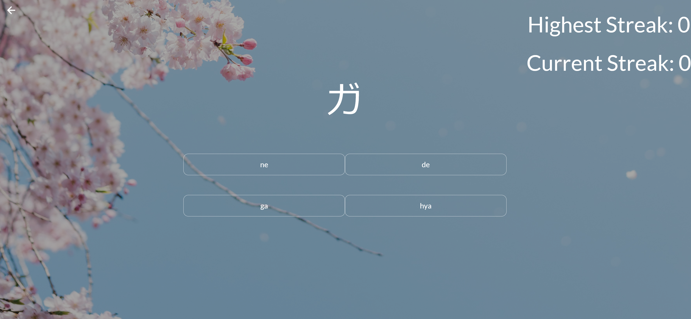

# Japanese Writing App

Live Link: https://japanese-writing.herokuapp.com/

# Purpose

This App was created to help people practice the Japanese writing systems Hiragana and Katakana.

# Built Using

- HTML
- CSS
- Materialize CSS
- JavaScript
- React.js
- Node.js
- Express.js
- Mongo DB
- Mongoose ODM
- Axios
- React-router-dom
- Heroku

# Screenshots

## Home

## Language Dashboard

## Multiple Choice (kana)

## Fill In The Blank
