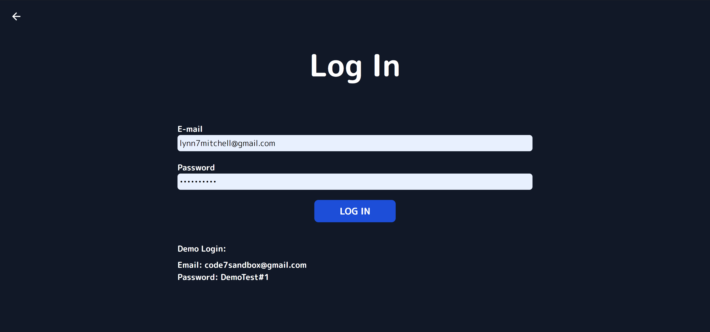

# Japanese Writing App

Live Link: https://japanese-writing.herokuapp.com/

## Purpose

This App was created to help people practice the Japanese writing systems Hiragana and Katakana.

## Built Using

- HTML
- Tailwind CSS
- JavaScript
- React.js
- Node.js
- Express.js
- Mongo DB
- Mongoose ODM
- Axios
- React-router-dom
- Heroku

## What's it look like?

### Home

### Language Dashboard

### Log In

### Multiple Choice

